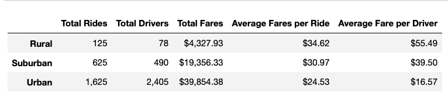
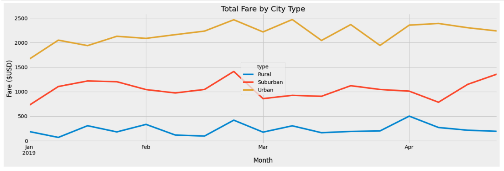

# PyBer_Analysis

## Overview of the analysis:
The purpose of this analysis was to explore relationships in ride sharing data among different types of cities.  Ride share data was gathered for 2,375 rides across 120 unique cities.  The cities were categorized as urban, suburban, and rural based on conventional definitions of each city type. The results provide useful insights for understanding the ride share financial trends for each city type. 

## Results:
As can be seen in Table 1, the total numbers of rides, drivers, and fares for rural cities were lower than those for suburban cities, which were lower than those for urban cities. However, the opposite relationship can be seen for average fares per ride and average fare per driver. The rural city type scored highest in both categories followed by the suburban city type. The urban city type had the lowest average fares per ride as well as average fare per driver.  

Table 1. Ride Share Summary by City Type

The sum of total fares for each city type calculated week over week for the period of January 2019 through April 2019 is presented in Figure 1 below. The trend lines for each city type appear to follow similar patterns of relative slight growth throughout January, then a slight down trend before a potential spike in late February. Another downtrend occurs in late march, followed by potentially different trends among the city types. It appears the sububran city type had an upward trend in late April while Urban and rural types trended downward.

Figure 1. Total Fares January Through April By City

## Summary:
In summary, it appears that for January through April of 2019, the relative trends among city types were fairly consistent. Despite rural cities having roughly 1.4 times higher average fare per ride ($34.62) than urban cities ($24.53), the urban cities consistently outpaced the rural and suburban cities on total fares on a weekly basis as seen in Figure 1. One recommendation is to investigate the potential spike in fares in late February as well as the upward trend for suburban city types in late April. There may have been some factors that can be leveraged to help increase fares. Another recommendation is to analyze the trend lines across the rest of the year. Widening the scope of that analysis will help inform trends throughout summer, fall and the holiday periods of winter. A third recommendation is to investigate driver supply and demand in each city type. If it is discovered that more drivers are needed in rural or suburban cities, there may be opportunities to advertise and recruit. 

